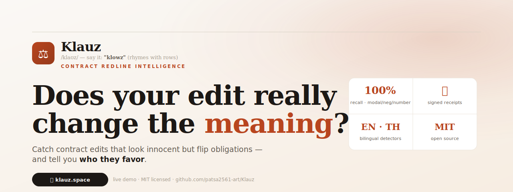
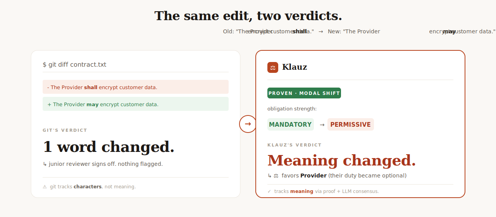

<p align="center">
  
</p>

<h1 align="center">⚖ Klauz</h1>
<p align="center">
  <i>Klauz</i> · /klaʊz/ · say it <b>"klowz"</b> (rhymes with <i>rows</i>) · ไทย: <b>เคลาซ์</b>
</p>
<p align="center">
  <b>Catch contract edits that look innocent but flip obligations — and tell you who they favor.</b>
</p>

<p align="center">
  <a href="https://klauz.space"><b>🌐 Live demo → klauz.space</b></a>
  &nbsp;·&nbsp;
  <a href="#-quick-start">Run locally</a>
  &nbsp;·&nbsp;
  <a href="#-how-it-works">How it works</a>
  &nbsp;·&nbsp;
  <a href="#-privacy">Privacy</a>
</p>

---

## The problem in one picture

Git tells you a word changed. It doesn't tell you a contract just flipped.

<p align="center">
  
</p>

A single `shall → may` swap converts a binding duty into an optional one. To `git`, that's "1 word changed." A junior reviewer signs off. You lose. **Klauz catches it deterministically — no AI guessing required.**

---

## What Klauz actually does

Drop a contract (or two versions) into [**klauz.space**](https://klauz.space) and:

| Tool | What it tells you | Needs AI? |
|---|---|---|
| **🚨 Tripwire** | 16 risky-clause patterns ranked for YOUR role (freelancer / SME / consumer / employee / enterprise) | No |
| **🔍 Audit** | Clause-by-clause review of a single document | Optional (local LLM) |
| **🧹 Lint** | Structural defects — dangling refs, leftover TBDs, unfilled blanks, duplicate definitions | No |
| **Compare** | What meaning actually changed between two versions + ⚖ who it favors | Optional (local LLM) |
| **🔏 Certify** | A signed receipt anyone can re-verify — proves what changed and that nothing was hidden | No (deterministic core) |
| **⚖ Reverse** | "If this contract were aimed at you, would you sign it?" — symmetry test | No |

Everything works **without AI** at the deterministic core. Add a local Ollama model for deeper semantic analysis. No API keys, no cloud, ever.

---

## 🚀 Quick start

### Use the hosted demo (zero install)

→ **<https://klauz.space>** — drop a file, click a button, see the result.

### Run on your own machine

```bash
git clone https://github.com/patsa2561-art/Klauz
cd Klauz
npm ci

# Web UI (recommended)
node bin/meaningdiff.js serve 7700
# → open http://127.0.0.1:7700

# Or one-shot CLI compare
node bin/meaningdiff.js examples/contract.before.txt examples/contract.after.txt
```

**Smart mode (optional, for nuanced semantic analysis):**

```bash
# Install Ollama once: https://ollama.com
ollama pull gemma3:12b
# Klauz auto-detects it. No config, no API key, no internet needed.
```

---

## 🧠 How it works

Klauz uses **selective prediction** — it commits to a verdict only when it can prove it, and abstains otherwise. Three layers:

```
  ┌─────────────────────────────────────────────────────────────┐
  │  TIER 1 · PROOF   (deterministic rules, 100% precision)     │
  │  • modal shifts (shall → may)                               │
  │  • negation flips (covers → does not cover)                 │
  │  • number changes (30 → 60 days)                            │
  │  • micro-logic prover (double-negatives, synonyms, idioms)  │
  └─────────────────────────────────────────────────────────────┘
                              ↓ if abstained
  ┌─────────────────────────────────────────────────────────────┐
  │  TIER 2 · CONSENSUS   (adversarial dual-LLM, local)         │
  │  prosecutor LLM + defender LLM. Agree → commit. Split → ↓   │
  └─────────────────────────────────────────────────────────────┘
                              ↓ if still uncertain
  ┌─────────────────────────────────────────────────────────────┐
  │  TIER 3 · ABSTAIN   (defer to human review)                 │
  │  Never silently wrong. Better honest than confidently bad.  │
  └─────────────────────────────────────────────────────────────┘
```

**Measured** on a 42-pair test corpus (English) + 15-pair Thai corpus:

- Proof tier alone: **40.5% coverage @ 100% precision, 0 errors**
- Proof + consensus: **83% coverage @ 100% precision, 0 silent errors**

Honest framing: 100% accuracy on every input is impossible for fuzzy semantic tasks. What Klauz guarantees is **100% precision on what it commits to** + a measured coverage number. The cases the system abstains on go to a human — never guessed.

---

## 🔒 Privacy

- **🔒 In-memory only** — documents are processed and immediately discarded
- **🚫 Zero document storage** — we never store, log, or read your document content
- **👁 You alone see content** — nobody else, ever
- **🌐 HTTPS end-to-end** — Let's Encrypt cert on klauz.space

For the strongest guarantee, run Klauz on your own machine. Documents never leave it.

---

## ✨ Features in depth

- **Bilingual detectors** — English + Thai out of the box (modal / negation / number patterns in both)
- **Proof-Carrying Redline (PCR)** — every signed certificate records the exact deterministic reasoning so anyone can re-verify with no model needed
- **Power-Shift meter** — when both parties are named, Klauz tells you which side a redline favors and by how much (e.g. _"this redline favors the Provider 80%"_)
- **Persona-aware risk (Tripwire)** — `auto-renew` is high-risk for an SME but low for an enterprise. Same clause, context-aware verdict.
- **Drop-in formats** — `.txt`, `.md`, `.docx`, `.pdf`, `.xlsx`, `.csv`, `.png` / `.jpg` (OCR via the local model if installed)
- **Cross-platform** — `npm run fullloop` works on Windows / Mac / Linux

---

## 🛠 Tech stack

- Pure Node.js (no framework dependencies for the core)
- Cryptography via `node:crypto` (ed25519 signatures, SHA-256 hashing)
- Optional local LLM via [Ollama](https://ollama.com) — no API keys, no cloud
- Web UI: vanilla HTML / CSS / JS (no build step, ~50 KB)

> **Naming note.** The product brand is **Klauz**. The CLI binary, file paths, and internal API still use `meaningdiff` as the code name — same relationship as Claude / Anthropic.

---

## 📜 License

MIT. Take it, learn from it, fork it.

---

<p align="center">
  Built by <a href="https://github.com/patsa2561-art">@patsa2561-art</a> · Live at <a href="https://klauz.space"><b>klauz.space</b></a>
</p>
